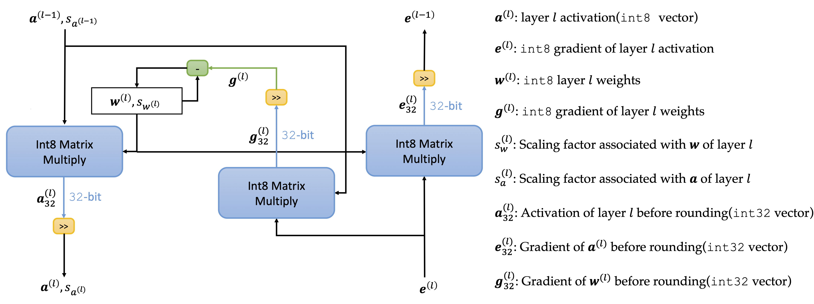
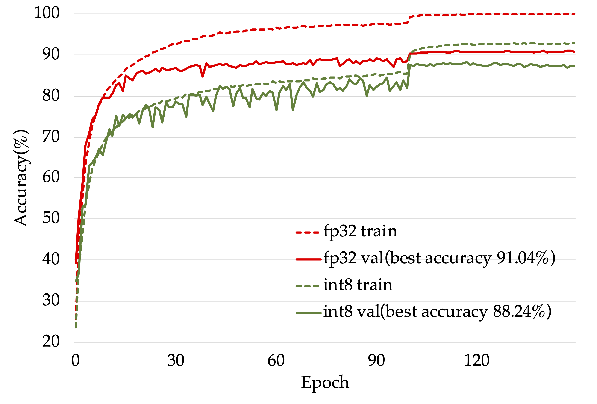

# Neural networks Training and Inference using Integer-only arithmetic

## Introduction
NITI is a training framework which uses 8 bits signed integer exclusively to train neural network.
It's currently implemented on Nvidia GPU with tensor cores(like V100, GTX 2080Ti, T4). 
The major computation flow of the convolution and fully connected layer are shown below:

## Usage
### Step 1: Install Nvidia docker
https://docs.nvidia.com/datacenter/cloud-native/container-toolkit/install-guide.html

### Step 2: Download NITI
> git clone https://github.com/wangmaolin/niti.git

### Step 3: Modify the path in docker_run.sh 
Change NITI_PATH in docker_run.sh to the location where you download NITI.

### Step 4: Launch the docker at $NITI_PATH
> docker_run.sh

### Step 5: Install the tensor core extension
Inside the docker, run:
> make install

## An example of training int8 VGG on CIFAR10 
> ./train_vgg_cifar10.sh

An example result is located at ./results/cifar10-vgg11-int8.

Results of training int8 VGG13 and fp32 baseline. For other results, please check our paper on the arxiv.

## Notes
Our current implementation utilizes cuBLAS(10.1) to run int8 matrix multiply operations directly on tensor cores.
However, there are no direct supports for int8 **batched** matrix multiply and 2D convolution even in the latest cuBLAS(11.0) and cuDNN(8.0).
So it hasn't reached the full acceleration potential of the idea that trains neural networks with integer-only arithmetic yet.
For now, it only serves as a prototype for the idea.

## Some key codes
### ti_torch.py 
Implementation of convolution, fully connected layer with int8 forward pass and backward pass 

### pytorch/tcint8mm-extension
CUDA extension using tensor core to accelerate 8 bit signed integer matrix multiply

### pytorch/int8im2col-extension
CUDA extension doing 8 bits integer image to column operation
