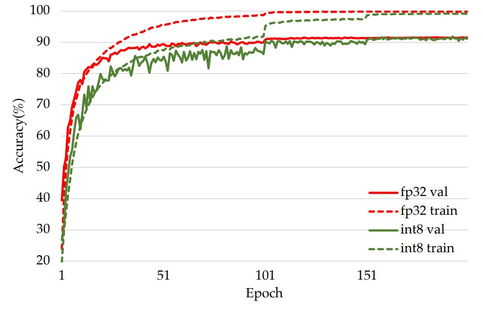

# Neural networks Training and Inference using Integer-only arithmetic

## Update(Nov 2021) 
I've made some improvments recently:
- Pure int8 training has no accuracy degradation on CIFAR10 comparing with fp32 now.
- Implementation of faster native int8 convolution forward pass and backward pass based on NVIDIA's cutlass 
- Update CUDA versoin to 11.1 to support RTX 3090(sm86). Please update driver and change the dockerfile pytorch version if you want to use it.
- The arxiv paper will be updated to discuss the improvements soon.

## Introduction
NITI is a training framework which uses 8 bits signed integer exclusively to train neural network.
It's currently implemented on Nvidia GPU with tensor cores(like V100, RTX 2080Ti, T4, RTX 8000, and RTX 3090). 
The major computation flow of the convolution and fully connected layer are shown below:

## Usage
### Step 1: Update NVIDIA driver and install NVIDIA docker
https://docs.nvidia.com/datacenter/cloud-native/container-toolkit/install-guide.html

### Step 2: Download NITI
> git clone https://github.com/wangmaolin/niti.git

### Step 3: Modify the path in docker_run.sh 
Change NITI_PATH in docker_run.sh to the location where you download NITI.

### Step 4: Launch the docker at $NITI_PATH
> docker_run.sh

### Step 5: Install the tensor core extension
Inside the docker, run:
> make 

## Examples of training int8 VGG on CIFAR10 
> ./train_vgg_cifar10.sh

## Visualize training results 
Example results of training VGG-small-7, VGG-small-8 and VGG-small-9 with integer arithmetic are located at ./results. Comparing with floating point, there is no accuracy degradation for these 3 networks.

For example, this is the training curves for VGG-small-9:

If you want to to check detailed training information, run:

> tensorboard --logdir results/int-vgg-small-8/runs

## Notes
Current implementation utilizes cuBLAS and CUTLASS to run int8 matrix multiply and convolution operations directly on tensor cores.

## Some key codes
### ti_torch.py 
Implementation of convolution, fully connected layer with int8 forward pass and backward pass 

### pytorch/cutlass-extension
CUDA extension doing 8 bits integer convolution forward pass and backward pass

### pytorch/tcint8mm-extension
CUDA extension using tensor core to accelerate 8 bit signed integer matrix multiply